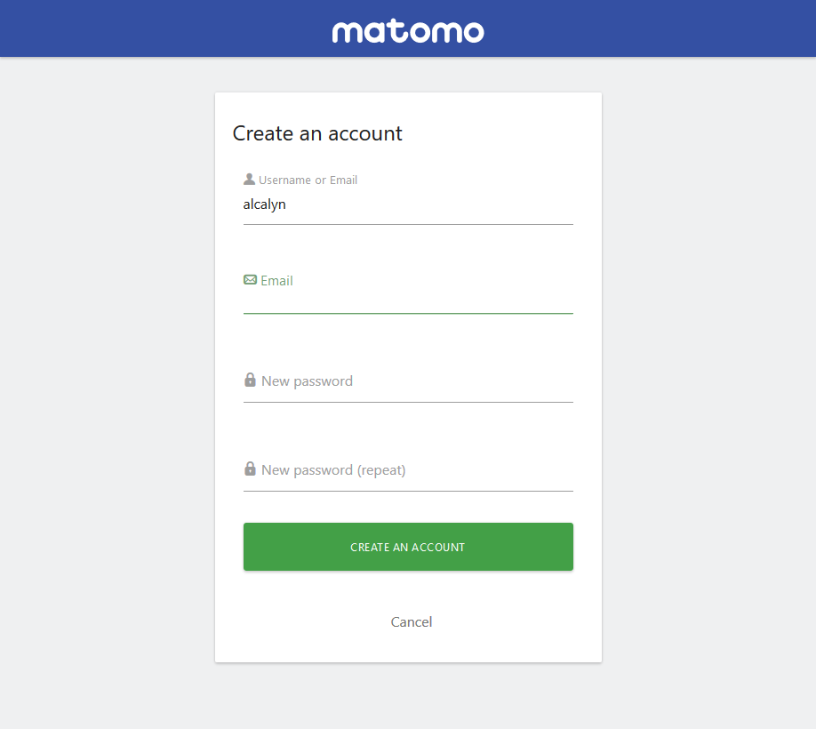

# Matomo Signup Plugin

Let new users signup on your Matomo instance to track their own website.

This plugin has been built in the aim to share your Matomo instance with other users.
It let them automatically create an account and a website in order to have
a tracking code and track their own website.

## Installation

- Install it from marketplace (or download and copy it in `plugins/Signup`).
- Activate it in your admin page.

Then you should see the new "Create an account" button on the login page.

## Usage

The "Create an account" button on the login page let any users to create their account and a website to track.
The new user will be given an access to his site to view his metrics, manage his user and site data, ecommerce objectives...

## Configuration

You can at any moment disable users signup by going to General Settings > Signup section.
No new users will be able to signup until you enable it again.

## License

This plugin is under [GPL-3.0+](LICENSE) license.
